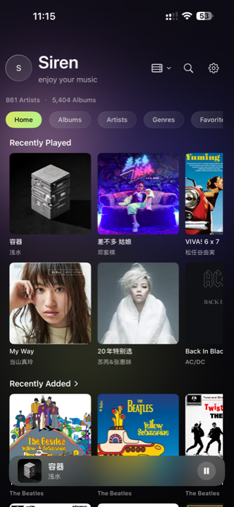
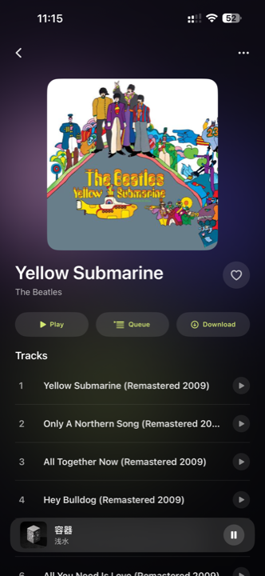
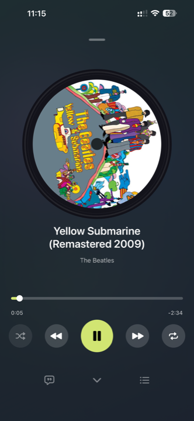

# SirenX

**A free, focused lossless music player for iPhone.**

No ads. No account. No subscription. No hidden purchases.

<table>
  <tr>
    <td width="33.33%"></td>
    <td width="33.33%"></td>
    <td width="33.33%"></td>
  </tr>
</table>

SirenX is built for people who keep their own music collections and want
a simple way to listen to them on iPhone.

Play music stored locally, connect to your own music servers, or access
your collection over SMB and WebDAV.

## Features

### Personal Music Library

- Album- and artist-focused music browsing
- Designed for personal music collections
- Local music import and playback
- Large-library support
- Local and online lyrics
- CUE sheet support

### Lossless Audio

SirenX supports common lossless and Hi-Res audio formats, including:

- FLAC
- ALAC
- WAV
- AIFF
- DSD
- AAC
- MP3

DSD playback is handled through real-time conversion to PCM on iPhone.

### Connect Your Music

SirenX can connect to:

- Navidrome / Subsonic
- Jellyfin
- Emby
- Plex
- SMB
- WebDAV

This makes it possible to access a self-hosted music collection without
moving the entire library onto your iPhone.

### Listening

- Offline music
- CarPlay
- Last.fm scrobbling
- 10-band EQ
- Headphone tuning
- AutoEQ and OPRA headphone profiles
- Background playback

## Philosophy

SirenX is not a streaming service.

There are no recommendations, social feeds, advertisements, or subscription
features competing for your attention.

It is designed around one thing: listening to your own music collection.

## Download

SirenX is available free on the Apple App Store.

[Download SirenX →](https://mossca.app/sirenx/?utm_source=github&utm_medium=referral)

More information:

[SirenX Website →](https://mossca.app/sirenx/?utm_source=github&utm_medium=referral)

[Version History →](CHANGELOG.md)

## Feedback & Issues

Bug reports, compatibility reports, and feature suggestions are welcome.

For bug reports, please include relevant information such as:

- SirenX version
- iPhone model
- iOS version
- Music source
- Audio format
- Steps to reproduce the issue

For server-related problems, please mention which server or protocol you use.

Never post passwords, API tokens, server credentials, private URLs,
or other sensitive information in public Issues or Discussions.

## Source Code

SirenX is proprietary software.

The application is free to use, but it is not open source.

This repository is used for product information, releases, documentation,
issue tracking, and community discussions. The application source code
is not published here.

## License

SirenX and its source code are proprietary software.

Copyright © SirenX. All rights reserved.